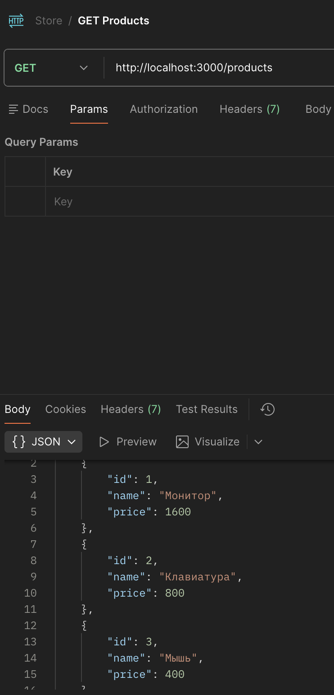
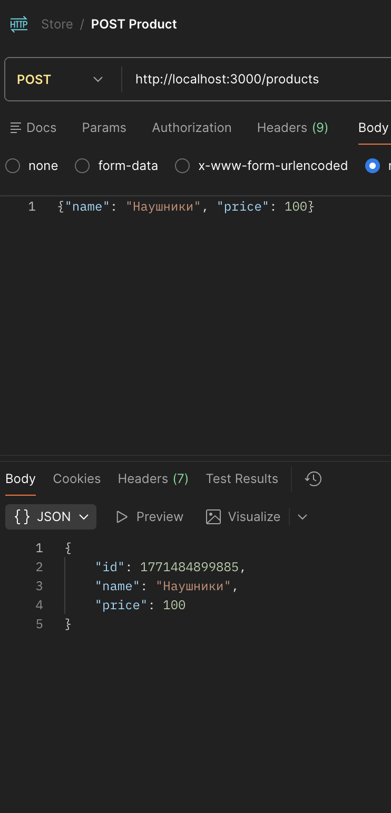
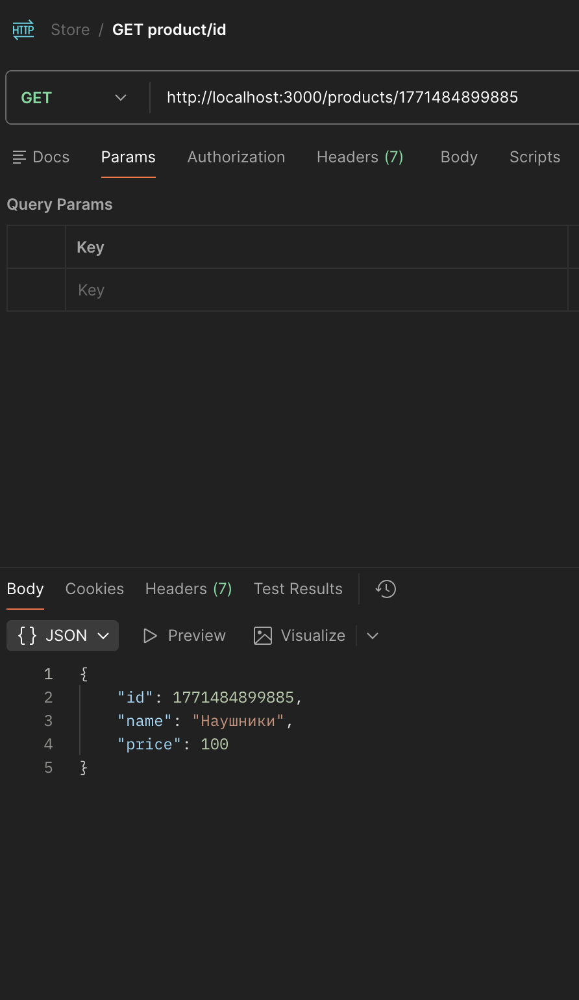
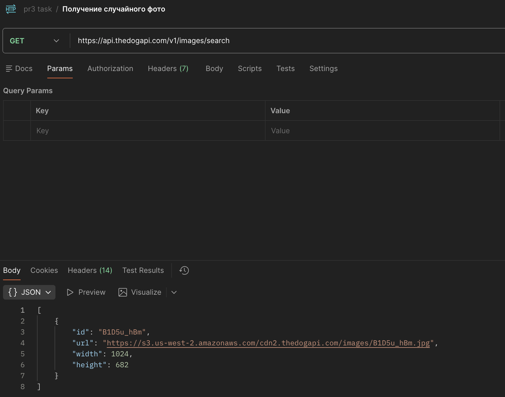
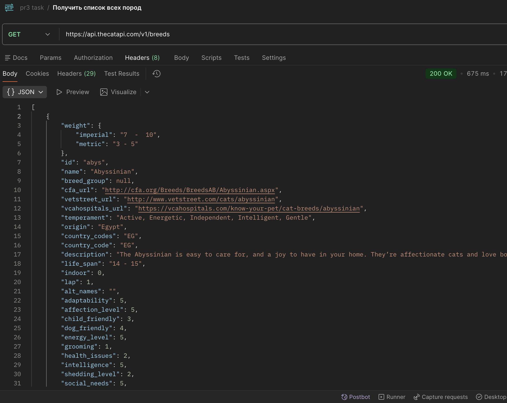
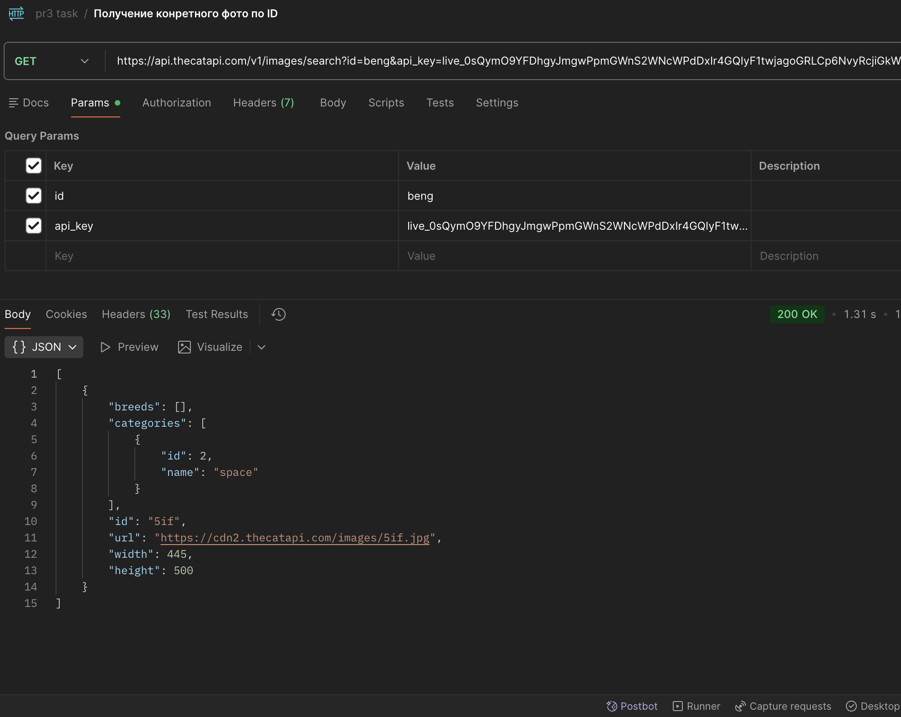
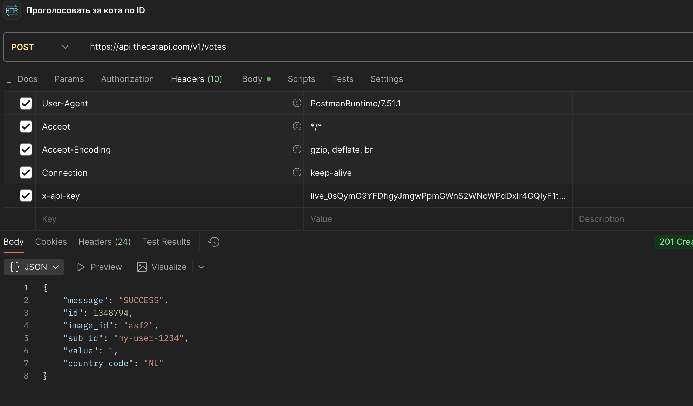
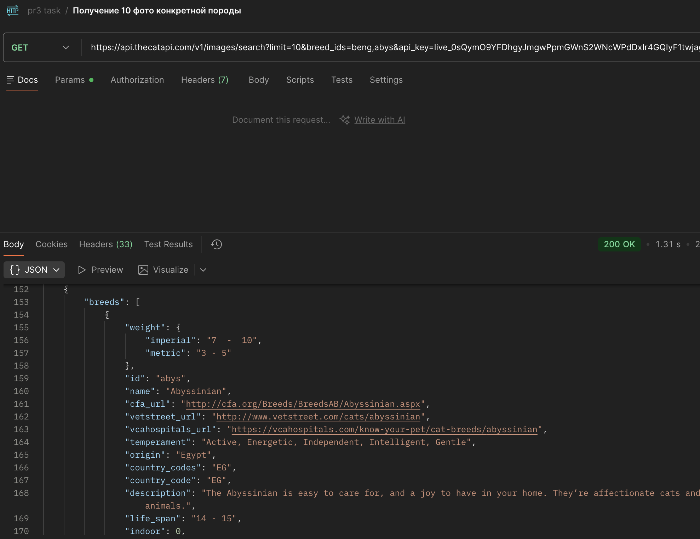

# Практическая работа 1‑2

В этом репозитории собраны результаты практических заданий по работе с API и инструментами тестирования.

## 1. Тестирование собственного API (Практическое занятие 2)

1. Запуск сервера
   ```bash
   # пример запуска (зависит от реализации API)
   node practise2/index.js
   ```
2. Тестирование с помощью Postman
   - выполнено **не менее трёх запросов** к реализованному API
   - в качестве примера запросов использовались следующие эндпоинты:
     1. `GET /products` — получение списка элементов
     2. `POST /products` — добавление нового элемента
     3. `DELETE /products/:id` — получение элемента по ID
   - скриншоты результатов тестирования (встроены ниже):

     
     
     

   - для изучения и воспроизведения достаточно открыть коллекцию Postman

## 2. Работа с публичным API

1. **Выбор API:** открыт API для получения информации о котах (пример)
2. **Получение ключа:** зарегистрировался на сайте, получил API‑ключ
3. **Изучение документации:** ссылка на документацию
   – [https://developers.thecatapi.com/view-account/ylX4blBYT9FaoVd6OhvR?report=bOoHBz-8t](https://developers.thecatapi.com/view-account/ylX4blBYT9FaoVd6OhvR?report=bOoHBz-8t)
4. Выполнено **не менее пяти запросов**:
   - `GET /v1/images/search` — получение случайного фото
   - `GET /v1/breeds` — получение списка всех пород
   - `GET /v1/images/search?id=beng&api_key={мой_апи_ключ}` — получение фото кота конкретной породы по ID
   - `POST /v1/votes` — проголосовать за кота по ID
   - `GET /v1/images/search?limit=10&breed_ids=beng,abys&api_key={мой_апи_ключ}` — получение 10 фото конкретных пород
5. Результаты представлены на скриншотах:
   
   
   
   
   

> 📁 Все изображения для отчёта находятся в каталоге `photo`.

---

### Примечания

- Файлы исходного кода для задания 2 находятся в папке `practise2`.
- При необходимости можно запускать API и проводить дополнительные тесты.

---

_Дата: 19 февраля 2026 года._
