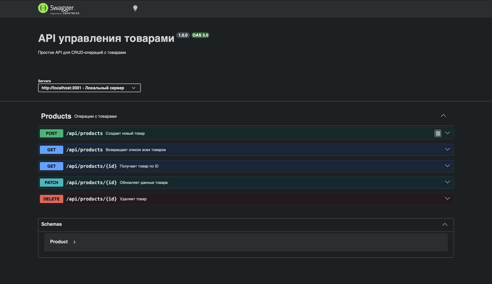
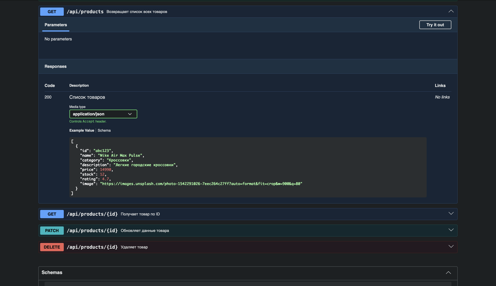
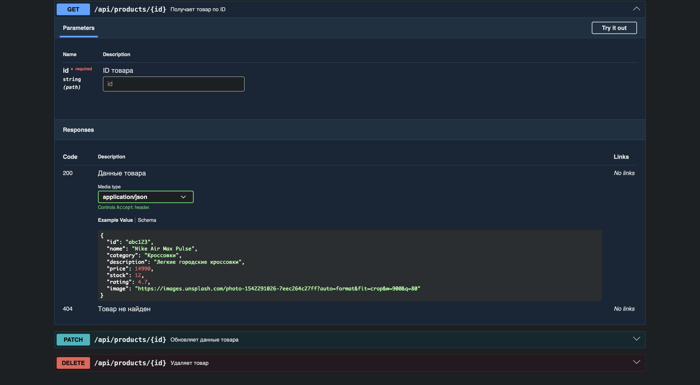
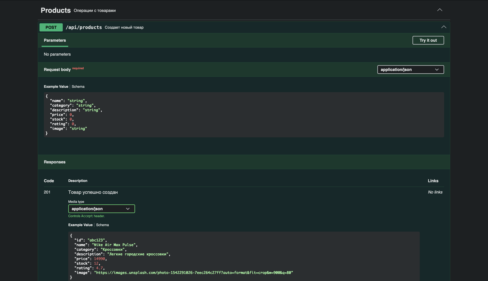
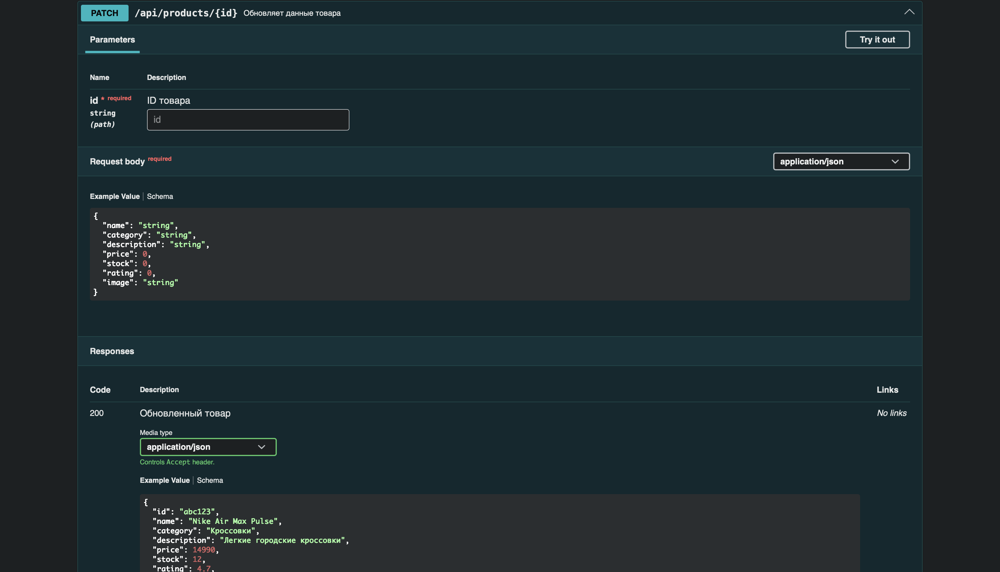
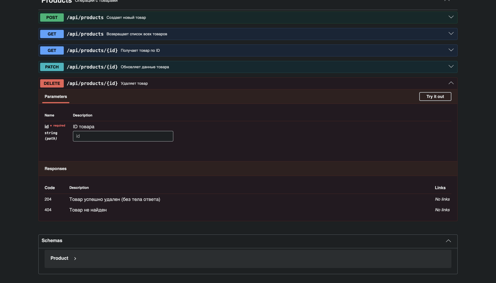

# Практика 5: Swagger для backend API

В этой практике показана документация Swagger для API из `practise4/server`.

Swagger UI доступен по адресу:

`http://localhost:3001/api-docs`

## Главная страница Swagger

## Методы API

### `GET /api/products`
Список всех товаров.

### `GET /api/products/{id}`
Получение товара по идентификатору.

### `POST /api/products`
Создание нового товара.

### `PATCH /api/products/{id}`
Частичное обновление товара.

### `DELETE /api/products/{id}`
Удаление товара.

